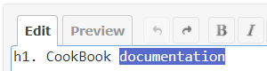
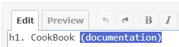

# Redmine Wiki Text Encloser

This is a plugin for Redmine.  
This plugin adds the ability to automatically enclose the selected text in the Wiki.

## Usage
1. Select the text you want to enclose.  

2. Enter the symbol to enclose the text. The closing symbol will be automatically added.  


### Supported Symbols
- !"#$%'(`{[</\\_~

## Installation
### When using git
1. Clone this repository to your Redmine plugins directory.
    ```
    cd YOUR_REDMINE_DIRECTORY/plugins
    git clone https://github.com/sk-ys/redmine_wiki_text_encloser.git
    ```
2. Restart Redmine.

### When not using git
1. Download zip file from the [release page](https://github.com/sk-ys/redmine_wiki_text_encloser/releases) or the [latest main repository](https://github.com/sk-ys/redmine_wiki_text_encloser/archive/refs/heads/main.zip). 
2. Extract the ZIP file to your Redmine plugin directory. The name of the unzipped directory must be `redmine_wiki_text_encloser`.
3. Restart Redmine.
